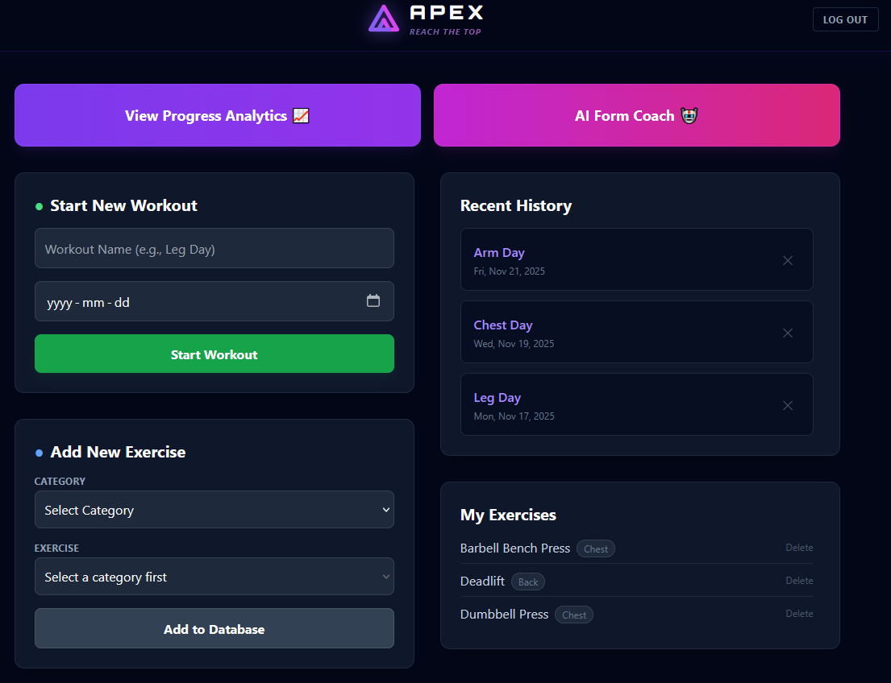
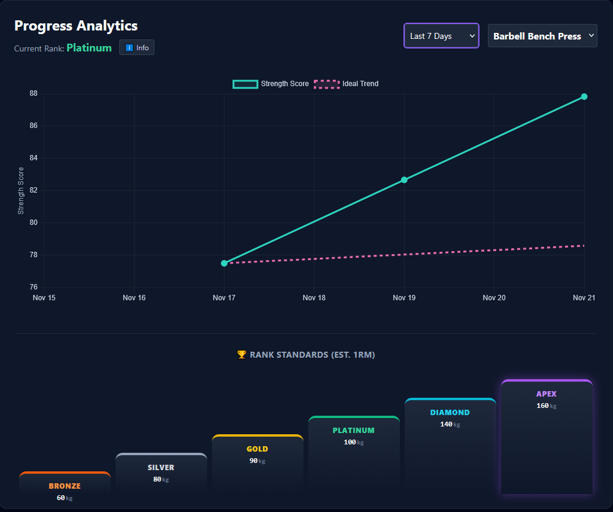

# 🏔️ Apex - AI-Powered Strength Tracker

Apex is a full-stack fitness application designed to help lifters track progressive overload and optimize their training. It features a custom-built workout logger, advanced analytics with trend visualization, and an AI-powered strength coach.

**Live Demo:** [https://apex-david-kim.vercel.app](https://apex-david-kim.vercel.app)

## ✨ Key Features

* **🏋️‍♂️ Intelligent Logging:** Create custom workouts and log sets, reps, and weight with a streamlined UI.
* **📈 Progressive Overload Analytics:** Visualizes strength progress over time using Estimated 1-Rep Max (E1RM) calculations. Includes an "Ideal Trend" line to benchmark progress against a 2.5% weekly growth target.
* **🤖 AI Form Coach:** Integrated OpenAI GPT-4o to provide instant, context-aware advice on form, injury prevention, and programming.
* **🏆 Gamified Ranking System:** Automatically calculates a user's strength tier (Bronze to Apex) based on real-world strength standards.
* **🔐 Secure Authentication:** Custom JWT-based auth system with bcrypt password hashing.
* **🚀 Smart Onboarding:** AI-generated workout splits based on user goals and experience level.

## 🛠️ Tech Stack

**Frontend:**
* React (Vite)
* Tailwind CSS (Dark Mode UI)
* Chart.js (Data Visualization)
* React Router (Navigation)

**Backend:**
* Node.js & Express
* PostgreSQL (Supabase)
* OpenAI API (AI Features)
* JSON Web Tokens (Auth)

**Deployment:**
* Frontend: Vercel
* Backend: Render

## 🚀 Getting Started

### Prerequisites
* Node.js (v18+)
* PostgreSQL Database (Supabase recommended)
* OpenAI API Key

### Installation

1.  **Clone the repository:**
    ```bash
    git clone [https://github.com/yourusername/apex.git](https://github.com/yourusername/apex.git)
    cd apex
    ```

2.  **Install Backend Dependencies:**
    ```bash
    cd server
    npm install
    ```

3.  **Install Frontend Dependencies:**
    ```bash
    cd ../client
    npm install
    ```

4.  **Environment Setup:**
    Create a `.env` file in the `/server` directory:
    ```env
    DATABASE_URL=your_postgres_connection_string
    JWT_SECRET=your_secret_key
    OPENAI_API_KEY=your_openai_key
    PORT=5000
    ```

5.  **Run Locally:**
    * **Backend:** `cd server && npm run dev`
    * **Frontend:** `cd client && npm run dev`

## 📸 Screenshots

| Dashboard | Analytics | Lighthouse Scores
|:---:|:---:|:---:
|  |  | 

## 👤 Author

**David Kim**
* [LinkedIn](https://www.linkedin.com/in/david-gs-kim)
* [GitHub](https://github.com/davidgskkim)